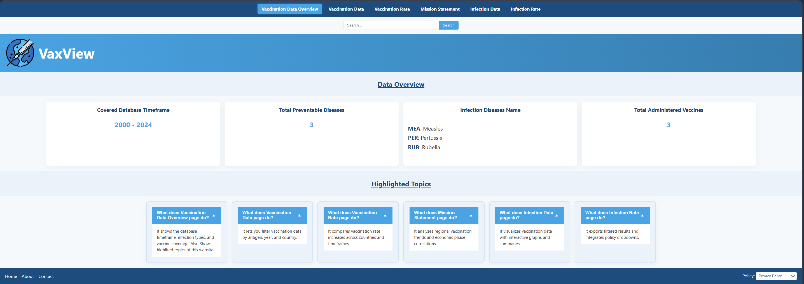
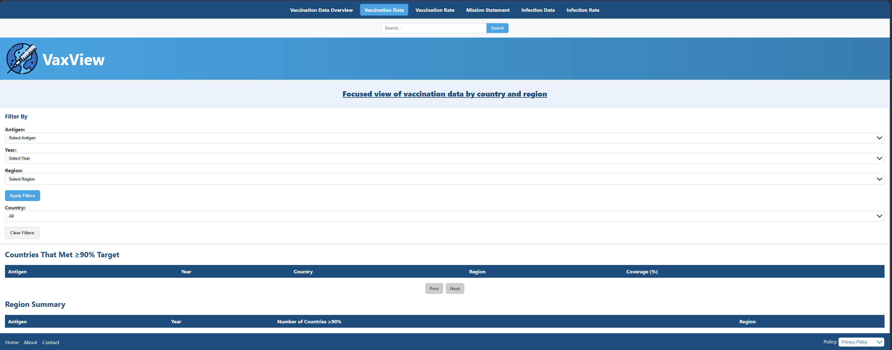
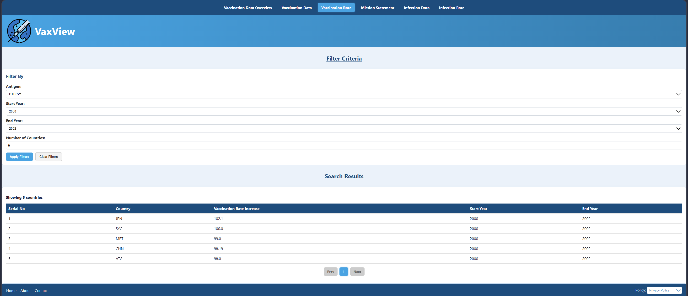

# VaxView Website

A web-based immunisation data management system developed using Python, SQLite, HTML, CSS, and JavaScript.

## Features
- Search and filter records
- Database integration
- Responsive UI
- Data management dashboard

## Technologies
- Python

### Database
- SQLite
- HTML
- CSS
- JavaScript

## Project Structure

```text
VaxView/
├── static/
├── templates/
├── database/
├── app.py
├── requirements.txt
└── README.md
```

## Installation

1. Clone the repository:

```bash
git clone https://github.com/your-username/VaxView.git
```

2. Navigate to the project directory:

```bash
cd VaxView
```

3. Install the required dependencies:

```bash
pip install -r requirements.txt
```

4. Run the application:

```bash
python app.py
```

5. Open your browser and visit:

```text
[http://localhost:80]
```

## Screenshots

### Home Page
(Add screenshot here)

### Search and Filter Functionality
(Add screenshot here)

### Dashboard
(Add screenshot here)

### Database Records
(Add screenshot here)

## Learning Outcomes

Through this project, we gained practical experience in:

- Full-stack web development
- Database design and integration
- Front-end user interface development
- Backend application development with Python
- Project collaboration and version control

## Authors

Developed by:

- Zawad Mahmud
- Tanzil Shakib

This project was developed as part of coursework at :contentReference[oaicite:0]{index=0}.

## License

This project is intended for educational and portfolio purposes.

---

## Screenshots

### Homepage


### Vaccination Data Analysis


### Vaccination Rate Analysis


### Dashboard Overview


---

## Project Objectives

The goal of VaxView is to provide a simple and accessible platform for analysing vaccination and infection datasets while demonstrating:

- Full-stack web development
- Database integration
- Data filtering and analysis
- User interface design
- Data visualisation principles

---

## Key Skills Demonstrated

- Python Programming
- Database Design
- SQL Queries
- Front-End Development
- Data Processing
- Full-Stack Development
- Team Collaboration
- Version Control with Git

---

## Authors

Developed by:

- Zawad Mahmud
- Tanzil Shakib

---

## Repository

This project is publicly available on GitHub for educational and portfolio purposes.

---

## License

MIT License